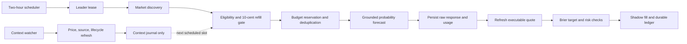

# Prophet Directional Trader

[](https://github.com/NiTHIN-K/prophet-directional-trader/actions/workflows/ci.yml)
[](https://www.python.org/)
[](LICENSE)

A paper-only prediction-market research system that reproduces the directional forecasting
workflow from [“When do prophets profit in prediction markets?”](https://arxiv.org/abs/2607.06166).
It combines fixed-cadence probability forecasts, executable bid/ask prices, proper Brier targets,
risk-aware position sizing, and a durable SQLite shadow ledger.

Strict replication mode is intentionally paper-only. Live order submission is rejected by
configuration validation and by the command-line interface.

## Portfolio focus

This project highlights backend engineering practices that matter in stateful financial systems:

- durable, transactional state for decisions, requests, positions, and cash;
- explicit budget reservations and fail-closed circuit handling;
- idempotent scheduled work protected by a leader lease and database constraints;
- offline tests covering the decision flow without provider access; and
- a strict boundary between simulated fills and live order submission.

## What it demonstrates

- UTC-aligned two-hour forecasting with a single-leader lease
- Gemini `gemini-3.1-pro-preview`, high reasoning, and Google Search grounding
- Executable quote and displayed-depth checks instead of deprecated liquidity metadata
- Bid/ask-aware Brier signals and fill-aware position rebalancing
- Durable request, usage, decision, order, cash, and position journals
- Atomic duplicate suppression and a configurable per-cycle call cap
- A fail-closed $1 daily forecast-spend ceiling
- Context-only monitoring for 3¢ moves, official releases, and lifecycle changes
- Timeout uncertainty, quota circuit breaking, and paper-only execution guardrails

## System flow



The forecast path and context watcher are deliberately separate. Event changes enrich the next
scheduled decision but cannot launch a provider request. See
[Architecture](docs/ARCHITECTURE.md) for the invariants and storage model.

## Quick start

Python 3.11 or newer is required.

```bash
git clone https://github.com/NiTHIN-K/prophet-directional-trader.git
cd prophet-directional-trader
python3 -m venv .venv
source .venv/bin/activate
python -m pip install -e .
cp .env.example .env
```

Add `GEMINI_API_KEY`. Kalshi authenticated requests also require a key ID and matching RSA
private-key path. `KALSHI_API_KEY` remains accepted as a legacy key-ID alias.

```dotenv
TRADING_MODE=paper
LIVE_TRADING_ENABLED=false
STRICT_PAPER_REPLICATION=true
GEMINI_API_KEY=replace-me
FORECASTING_ENABLED=true
SCHEDULER_ENABLED=true
```

Validate the configuration without making a network request:

```bash
prophet-trader doctor
```

Never commit `.env`, private keys, SQLite databases, or logs. They are excluded by the repository
ignore rules.

## Command line

```bash
# Inspect eligible markets without forecasting
prophet-trader scan --limit 10

# Run at most once for the current two-hour slot
prophet-trader run-once

# Stay active and run on UTC-aligned two-hour boundaries
prophet-trader daemon

# Refresh context without constructing a forecast client
prophet-trader watch-once

# Inspect cycles, requests, usage, spend, decisions, and circuit state
prophet-trader status --limit 20
```

For cron setup, durable-ledger behavior, health checks, and the kill switch, see
[Operations](docs/OPERATIONS.md).

## Safeguards

Every provider call is reserved in SQLite before submission. The database rejects duplicates by
market, two-hour slot, model, prompt version, and context hash, with an additional once-per-market
slot guard. A single scheduler lease prevents concurrent leaders.

The raw provider response and usage metadata are stored before JSON parsing. The journal includes
input, cached, reasoning, output, and total tokens; search queries; duration; provider request ID;
raw response; and estimated cost.

A deadline failure is marked `UNKNOWN` and is never automatically retried. An unresolved request
blocks that market from further submissions. `insufficient_quota` opens the circuit immediately
and cancels queued forecasts. Cost reservations fail closed against
`DAILY_FORECAST_SPEND_LIMIT`, which defaults to $1.

Forecast output is constrained to:

- `probability_yes`
- `rationale` of at most 250 words
- `confidence` (`low`, `medium`, or `high`)
- `key_sources`, with at most two title/URL entries

## Configuration highlights

| Variable | Default | Purpose |
| --- | ---: | --- |
| `GEMINI_MODEL` | `gemini-3.1-pro-preview` | Forecast model |
| `GEMINI_REASONING_LEVEL` | `high` | Required reasoning level |
| `GEMINI_MAX_OUTPUT_TOKENS` | `2000` | Output ceiling |
| `CYCLE_SECONDS` | `7200` | Fixed forecast cadence |
| `MAX_FORECASTS_PER_CYCLE` | `4` | Per-cycle call cap |
| `DAILY_FORECAST_SPEND_LIMIT` | `1.00` | Daily estimated provider-spend ceiling |
| `FORECAST_RESERVE_COST_DOLLARS` | `0.15` | Conservative reservation per call |
| `REFRESH_MOVE_THRESHOLD` | `0.10` | Reforecast threshold after a fill |
| `MIN_LIQUIDITY_DOLLARS` | `1` | Required displayed depth per direction |
| `PAPER_STARTING_CASH` | `200` | Starting cash for a new shadow database |
| `STATE_DB_PATH` | `state/trader.sqlite3` | Durable journal and shadow ledger |

`PAPER_STARTING_CASH` is applied only when a new database initializes. Scheduled runs reuse the
same cash balance, positions, fills, and account history.

## Verification

The test suite is fully offline. Test environments cannot enable forecasting or start the
scheduler.

```bash
python -m unittest discover -s tests -v
```

Coverage includes duplicate-cycle suppression, scheduler isolation, timeout no-retry semantics,
quota circuit breaking, daily spend failure, displayed-depth execution, one-sided position exits,
and context-only event updates.

## Demonstration boundaries

Shadow fills assume immediate execution at displayed quotes and do not model fees, slippage,
queue priority, partial fills, or settlement cash flows. Cost reservation is conservative, while
the journaled post-response estimate reflects reported usage. This is experimental research
software, not official code from the paper, Kalshi, or Google; profitability is not guaranteed.

## License

Released under the [MIT License](LICENSE).
